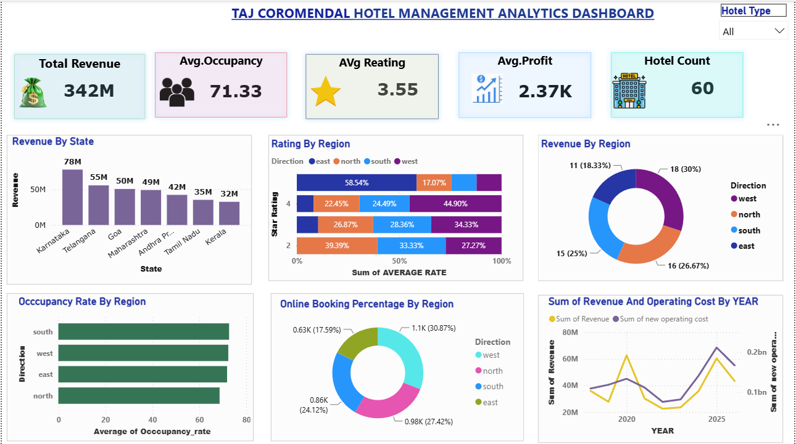

# 🏨 Hotel Management Analytics Dashboard using Power BI

## 📌 Project Overview

This project is an interactive Hotel Management Analytics Dashboard developed using **Power BI**, **SQL**, and **Snowflake**. The dashboard provides valuable insights into hotel performance by analyzing revenue, occupancy, customer ratings, profit, bookings, and regional trends.

The project demonstrates end-to-end business intelligence by connecting Power BI to Snowflake, transforming and analyzing data, and creating interactive visualizations for better decision-making.

---

# 🎯 Objectives

- Analyze hotel revenue and profitability.
- Monitor occupancy rates across different regions.
- Compare hotel performance by state and region.
- Evaluate customer ratings.
- Track online booking percentages.
- Support business decisions through interactive dashboards.

---

# 🛠️ Technologies Used

- Power BI
- SQL
- Snowflake
- DAX
- Power Query

---

# 📊 Dashboard Preview



---

# 📈 Key Performance Indicators (KPIs)

- 💰 Total Revenue
- 🏨 Hotel Count
- ⭐ Average Rating
- 📊 Average Occupancy Rate
- 💵 Average Profit

---

# 📊 Dashboard Features

- Revenue by State
- Revenue by Region
- Occupancy Rate by Region
- Rating Analysis by Region
- Online Booking Percentage by Region
- Revenue vs Operating Cost Trend
- Interactive Hotel Type Filter

---

# 💡 Key Insights

- Karnataka generated the highest revenue among all states.
- The average hotel occupancy rate is above 70%.
- Revenue distribution varies across different regions.
- Online bookings contribute significantly to hotel reservations.
- Revenue and operating costs can be compared yearly to identify business trends.
- Customer ratings help evaluate hotel service quality.

---

# 🚀 Business Benefits

- Helps management monitor hotel performance.
- Identifies high-performing regions.
- Supports revenue optimization.
- Improves occupancy planning.
- Enables data-driven business decisions.

---

# 📂 Project Structure

```
Hotel-Management-Dashboard-PowerBI/
│── Hotel_Management_Dashboard.pbix
│── README.md
│── dashboard_overview.png
```

---

# ▶️ How to Use

1. Download the `.pbix` file.
2. Open it using Microsoft Power BI Desktop.
3. Refresh the data connection if required.
4. Interact with the dashboard using filters and slicers.

---

# 📚 Skills Demonstrated

- Data Analysis
- Business Intelligence
- Dashboard Design
- Data Visualization
- SQL Querying
- Snowflake Data Warehousing
- DAX Calculations
- Power Query Data Transformation

---

# 👨‍💻 Author

**Sudharsan M M**

📧 Email: Sudharsan.m.m344@gmail.com

💼 LinkedIn: https://www.linkedin.com/in/sudharsan344

💻 GitHub: https://github.com/sudharsan344
