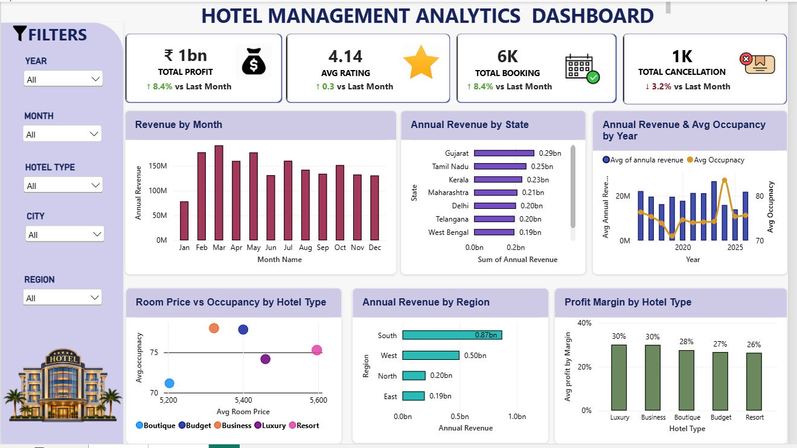

# 🏨 Hotel Management Analytics Dashboard

## 📊 Project Overview

The **Hotel Management Analytics Dashboard** is an interactive Power BI data analytics project designed to analyze hotel booking performance, occupancy, revenue, cancellations, and profitability.

The project transforms raw hotel booking data into meaningful business insights using **SQL, Snowflake, Power Query, and Power BI**. The dashboard helps hotel management understand booking trends, revenue performance, customer behavior, and operational efficiency.

---

## 🎯 Project Objectives

* Analyze hotel booking and reservation trends
* Monitor key performance indicators (KPIs)
* Analyze revenue and profit performance
* Understand occupancy patterns
* Identify cancellation trends
* Compare hotel performance over time
* Provide actionable insights for data-driven decision-making

---

## 🛠️ Tools & Technologies

| Tool            | Purpose                                     |
| --------------- | ------------------------------------------- |
| **Snowflake**   | Data storage and SQL-based data processing  |
| **SQL**         | Data querying, transformation, and analysis |
| **Power Query** | Data cleaning and transformation            |
| **Power BI**    | Dashboard development and visualization     |
| **DAX**         | Calculated measures and KPI calculations    |
| **Excel/CSV**   | Raw data source                             |

---

## 📌 Key KPIs

The dashboard includes **10+ KPIs**, including:

* 💰 Total Revenue
* 📈 Total Profit
* 🏨 Total Bookings
* 👥 Total Customers/Guests
* 🛏️ Occupancy Rate
* ❌ Cancellation Rate
* 💵 Average Daily Rate (ADR)
* 📊 Average Revenue
* 📅 Monthly Booking Trends
* 📉 Profit Margin

---

## 📊 Dashboard Features

### 1. Booking Analysis

* Total bookings
* Monthly booking trends
* Booking performance by hotel
* Customer booking patterns

### 2. Revenue & Profit Analysis

* Total revenue
* Total profit
* Profit margin
* Revenue trends over time
* Hotel-wise revenue comparison

### 3. Occupancy Analysis

* Occupancy rate
* Room utilization
* Monthly occupancy trends
* Comparison between hotels

### 4. Cancellation Analysis

* Cancellation rate
* Cancellation trends
* Hotel-wise cancellation performance

### 5. Interactive Dashboard

The Power BI dashboard includes:

* KPI Cards
* Bar Charts
* Line Charts
* Donut/Pie Charts
* Slicers
* Filters
* Interactive visualizations

Users can filter the dashboard to analyze specific hotels, months, and other business dimensions.

---

## 🔄 Data Analysis Process

```text
Raw Hotel Data
      ↓
Snowflake
      ↓
SQL Data Processing
      ↓
Power Query
      ↓
Data Cleaning & Transformation
      ↓
Data Modeling
      ↓
DAX Calculations
      ↓
Power BI Dashboard
      ↓
Business Insights
```

---

## 🧹 Data Preparation

The dataset was processed using SQL and Power Query.

Key data preparation activities included:

* Removing unnecessary columns
* Handling missing values
* Cleaning inconsistent data
* Transforming data types
* Creating calculated columns
* Creating date/month-related fields
* Preparing data for visualization
* Creating relationships between tables

---

## 📐 Data Modeling & DAX

Power BI data modeling was used to establish relationships between relevant tables.

DAX measures were created to calculate important business metrics such as:

* Revenue
* Profit
* Profit Margin %
* Occupancy Rate
* Booking Count
* Cancellation Rate
* Average Revenue

---

## 💡 Key Business Insights

The dashboard can help hotel management identify:

* Which hotels generate the highest revenue
* Monthly booking and revenue patterns
* Periods with higher or lower occupancy
* Cancellation patterns
* Profitability trends
* Hotels with stronger operational performance
* Opportunities to improve revenue and occupancy

---

## 📷 Dashboard Preview

> Add your Power BI dashboard screenshot here.

```text

```

---

## 📁 Project Structure

```text
Hotel-Management-Dashboard-PowerBI/
│
├── README.md
│
├── Dataset/
│   └── hotel_data.csv
│
├── SQL/
│   └── hotel_analysis.sql
│
├── PowerBI/
│   └── Hotel_Management_Dashboard.pbix
│
├── Images/
│   └── hotel-dashboard.png
│
└── Documentation/
    └── project-documentation.pdf
```

---

## 🚀 Project Outcome

This project demonstrates practical experience in:

* SQL data analysis
* Snowflake
* Data cleaning and transformation
* Power BI dashboard development
* DAX calculations
* Data modeling
* KPI development
* Business intelligence
* Data visualization
* Business insight generation

The final dashboard converts raw hotel data into an **interactive business intelligence solution** that can support hotel performance monitoring and data-driven decision-making.

---

## 👨‍💻 Skills Demonstrated

**SQL | Snowflake | Power BI | DAX | Power Query | Data Cleaning | Data Modeling | Data Visualization | KPI Reporting | Business Intelligence | Data Analysis**

---

## 📌 Author

**Sudharsan**
📧 Email: Sudharsan.m.m344@gmail.com

💼 LinkedIn: https://www.linkedin.com/in/sudharsan344

💻 GitHub: https://github.com/sudharsan344

Aspiring Data Analyst | SQL | Power BI | Excel | Python

---

⭐ If you find this project useful, feel free to explore the repository and provide feedback.


